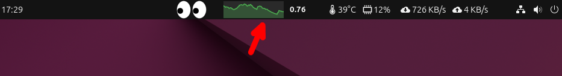

# GXLoad (GNOME shell extension)

A GNOME Shell extension that recreates the classic UNIX `xload` command. Displays real-time system load average in the top bar with a graph and numeric value.



## Features

- Real-time load average display from `/proc/loadavg`
- Interactive graph visualization (line or bar style)
- Click to show `top` command output with process details
- Customizable appearance via settings
  - Graph width and type (line/bar)
  - Auto-scaling option
  - Fill graph option
  - Foreground/background colors
  - Update interval

## Supported Versions

- GNOME Shell 45, 46, 47, 48

## Installation

### From GNOME Extensions (Recommended)

<!-- Add URL after publishing
Install with one click from [GNOME Extensions](https://extensions.gnome.org/extension/XXXX/gxload/).
-->

*Coming soon*

### Manual Installation

1. Clone the repository

```bash
git clone https://github.com/namake-taro/gxload.git
cd gxload
```

2. Copy to extensions directory

```bash
mkdir -p ~/.local/share/gnome-shell/extensions/gxload@namake-taro.github.io
cp -r ./* ~/.local/share/gnome-shell/extensions/gxload@namake-taro.github.io/
```

3. Compile schemas

```bash
glib-compile-schemas ~/.local/share/gnome-shell/extensions/gxload@namake-taro.github.io/schemas/
```

4. Restart GNOME Shell
   - **Wayland**: Log out and log back in
   - **X11**: Press `Alt+F2`, type `r`, press `Enter`

5. Enable the extension

```bash
gnome-extensions enable gxload@namake-taro.github.io
```

Or enable it from the Extensions app.

## Configuration

Open settings from the Extensions app, or run:

```bash
gnome-extensions prefs gxload@namake-taro.github.io
```

### Settings

| Setting | Description | Default |
|---------|-------------|---------|
| Update Interval | Seconds between updates | 2 |
| Graph Width | Width of the graph (pixels) | 50 |
| Graph Type | Line or bar graph | Line |
| Max Load Value | Maximum value for graph scale | 4.0 |
| Auto Scale | Automatically adjust graph scale | Off |
| Fill Graph | Fill area under the line | On |
| Foreground Color | Color of the graph | Green |
| Background Color | Background color of the graph | Dark gray |
| Top Output Text Color | Color of the top output text | Black |

## Uninstall

```bash
gnome-extensions disable gxload@namake-taro.github.io
rm -rf ~/.local/share/gnome-shell/extensions/gxload@namake-taro.github.io
```

## License

GPL-3.0

## Author

[@namake-taro](https://github.com/namake-taro)
